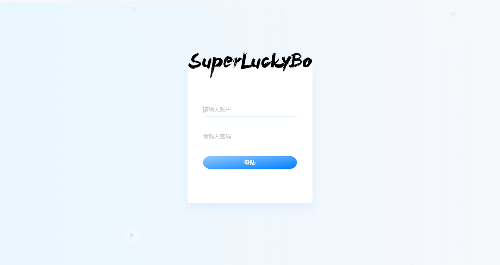
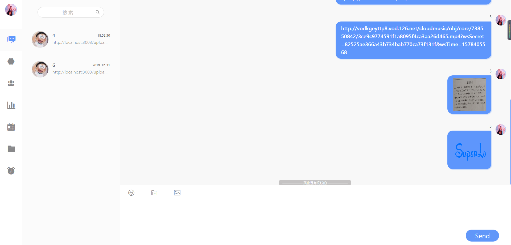
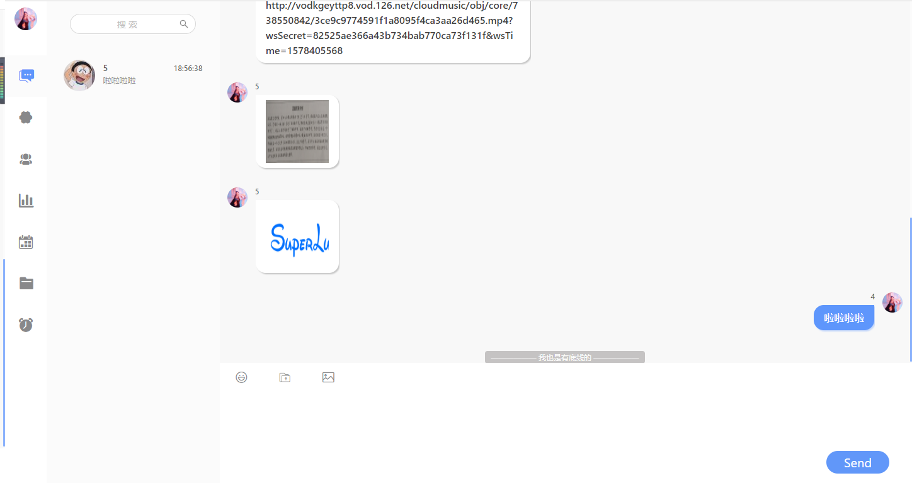
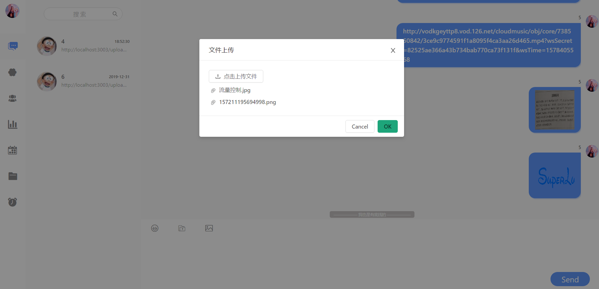
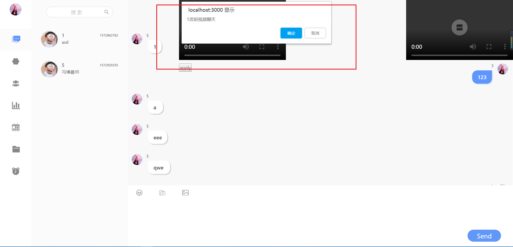
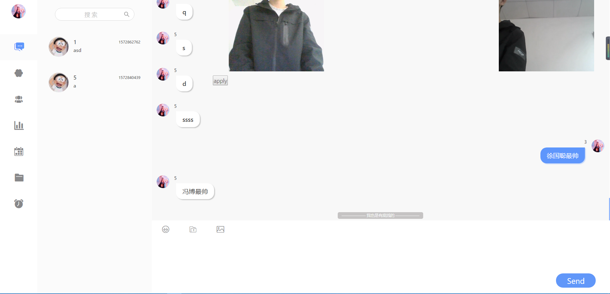

#### 环境依赖
Node
MySql
Npm

#### freeChat(react)

本项目是作为本科数字媒体资源管理的平时作业与期末大作业的一个模块，希望借助完成这个即时通信app。

#### 技术栈
前端 React 全家桶,后端暂时先用 koa2.x ，数据库mysql， 双向通信Socket.io。
初步先用ant-design进行快速开发，随后进行ui组件重写s

#### 项目展示

